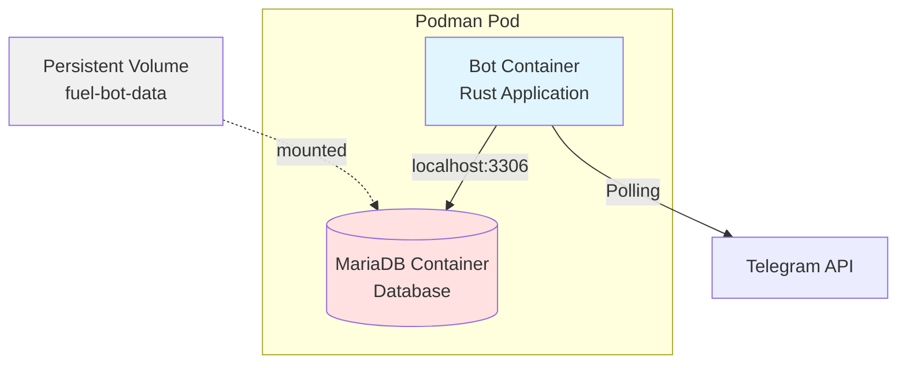
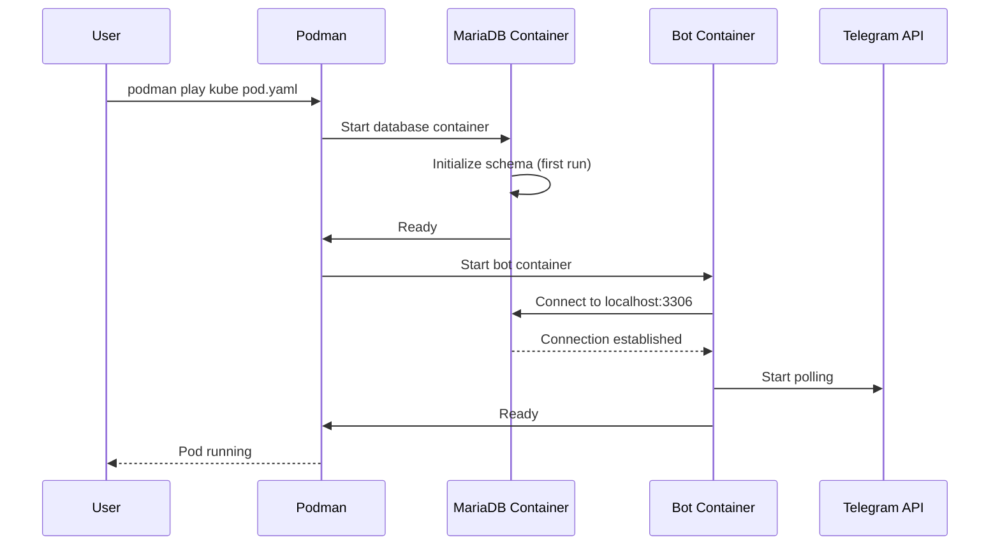

# Design Document: Containerized Deployment

## Overview

This design specifies a production-ready containerized deployment solution for the Telegram fuel expense bot using Podman pods. The solution consists of two main artifacts:

1. **Multi-stage Dockerfile**: Builds a minimal bot container image using Rust's release optimization
2. **Podman pod specification**: Orchestrates the bot and MariaDB database as a single deployable unit

The design emphasizes simplicity, security, and minimal configuration. By leveraging Podman's pod networking model, both containers share a network namespace and communicate via localhost, eliminating the need for complex networking configuration or exposed ports.

### Key Design Decisions

- **Podman over Docker Compose**: Podman pods provide true pod semantics (shared network namespace) similar to Kubernetes, making the deployment more portable and secure
- **Minimal configuration**: Only TELEGRAM_TOKEN is required; database credentials are internal to the pod
- **Multi-stage builds**: Separate build and runtime stages minimize final image size
- **Distroless runtime**: Use Google's distroless images or Alpine for minimal attack surface
- **No external ports**: Bot uses polling mode; database is internal to pod

## Architecture

### Component Diagram



### Deployment Flow



## Components and Interfaces

### 1. Multi-Stage Dockerfile

The Dockerfile consists of two stages:

#### Build Stage
- **Base Image**: `rust:1.75-bookworm` (or latest stable)
- **Purpose**: Compile the Rust application with release optimizations
- **Key Operations**:
  - Copy Cargo.toml and Cargo.lock
  - Download and cache dependencies
  - Copy source code
  - Build with `--release` flag
  - Strip debug symbols from binary

#### Runtime Stage
- **Base Image**: `gcr.io/distroless/cc-debian12` or `alpine:3.19`
- **Purpose**: Provide minimal runtime environment
- **Key Operations**:
  - Copy compiled binary from build stage
  - Copy .env.container file with database connection settings
  - Set non-root user (UID 1000)
  - Configure working directory
  - Set entrypoint to bot binary

**Interface**: The Dockerfile produces a container image tagged as `fuel-bot:latest` (or versioned tag)

### 2. Podman Pod Specification

The pod specification is defined in Kubernetes YAML format (compatible with `podman play kube`).

#### Pod Metadata
```yaml
apiVersion: v1
kind: Pod
metadata:
  name: fuel-bot-pod
  labels:
    app: fuel-expense-bot
```

#### Container Specifications

**MariaDB Container**:
- Image: `docker.io/library/mariadb:11.2`
- Environment Variables:
  - `MARIADB_ROOT_PASSWORD`: Internal root password
  - `MARIADB_DATABASE`: fuel_expense_bot
  - `MARIADB_USER`: fuel_bot
  - `MARIADB_PASSWORD`: Internal bot password
- Volume Mounts:
  - `/var/lib/mysql`: Persistent data storage
  - `/docker-entrypoint-initdb.d`: Initialization scripts
- Health Check: `mysqladmin ping -h localhost`

**Bot Container**:
- Image: `localhost/fuel-bot:latest` (built from Dockerfile)
- Environment Variables:
  - `TELEGRAM_TOKEN`: Required, provided by user at runtime
  - `DEFAULT_LIMIT`: Optional, defaults to 210.00
  - `RUST_LOG`: Optional, defaults to telegram_fuel_bot=info
- Build-Time Configuration (from .env.container):
  - `DB_HOST`: localhost
  - `DB_PORT`: 3306
  - `DB_USERNAME`: fuel_bot
  - `DB_PASSWORD`: fuel_bot_internal_pass (matches MariaDB container)
  - `DB_DATABASE`: fuel_expense_bot
  - `DB_MAX_CONNECTIONS`: 5
- Depends On: MariaDB container (via init containers or restart policy)
- Health Check: `pgrep -f telegram-fuel-bot` or process check

#### Volume Configuration
```yaml
volumes:
  - name: fuel-bot-data
    persistentVolumeClaim:
      claimName: fuel-bot-pvc
  - name: init-scripts
    hostPath:
      path: ./scripts
      type: Directory
```

### 3. Configuration Management

Since the bot and database run in the same pod, configuration is simplified:

**Build-Time Configuration** (via .env.container file copied into image):
```bash
# .env.container - Database connection settings for containerized deployment
DB_HOST=localhost
DB_PORT=3306
DB_USERNAME=fuel_bot
DB_PASSWORD=fuel_bot_internal_pass
DB_DATABASE=fuel_expense_bot
DB_MAX_CONNECTIONS=5
```

**Runtime Configuration** (provided at deployment):
- `TELEGRAM_TOKEN`: Must be provided via environment variable or secret

**Optional Runtime Configuration**:
- `DEFAULT_LIMIT`: Spending limit for new users (default: 210.00)
- `RUST_LOG`: Logging level (default: telegram_fuel_bot=info)

### 4. Deployment Commands

The deployment uses standard Podman commands:

**Build the bot container image**:
```bash
podman build -t fuel-bot:latest -f Dockerfile .
```

**Create the persistent volume claim**:
```bash
podman play kube pvc.yaml
```

**Deploy the pod** (requires TELEGRAM_TOKEN):
```bash
# Edit pod.yaml to set your TELEGRAM_TOKEN first, or use sed:
sed -i 's/YOUR_TELEGRAM_TOKEN_HERE/your_actual_token/' pod.yaml
podman play kube --replace pod.yaml
```

**Check pod status**:
```bash
podman pod ps --filter name=fuel-bot-pod
```

**View logs**:
```bash
# Bot logs
podman logs -f fuel-bot-pod-fuel-bot-app

# Database logs
podman logs -f fuel-bot-pod-fuel-bot-db
```

**Stop and remove the pod**:
```bash
podman pod stop fuel-bot-pod
podman pod rm fuel-bot-pod
```

## Data Models

### Container Image Structure

**Bot Image Layers**:
1. Base distroless/Alpine layer (~5-20 MB)
2. Compiled Rust binary (~10-30 MB)
3. Total: ~15-50 MB

**Database Image**: Standard MariaDB image (~400 MB)

### Volume Data Structure

**fuel-bot-data volume** (persistent):
```
/var/lib/mysql/
├── fuel_expense_bot/
│   ├── config.frm
│   ├── config.ibd
│   ├── counts.frm
│   └── counts.ibd
├── mysql/
└── performance_schema/
```

### Environment Variable Schema

**Runtime (Required)**:
- `TELEGRAM_TOKEN` (string): Bot authentication token from @BotFather

**Runtime (Optional)**:
- `DEFAULT_LIMIT` (decimal): Default monthly spending limit (default: 210.00)
- `RUST_LOG` (string): Log level configuration (default: telegram_fuel_bot=info)

**Build-Time** (from .env.container file):
- `DB_HOST` (string): Database host (localhost)
- `DB_PORT` (integer): Database port (3306)
- `DB_USERNAME` (string): Bot database user (fuel_bot)
- `DB_PASSWORD` (string): Bot database password (fuel_bot_internal_pass)
- `DB_DATABASE` (string): Database name (fuel_expense_bot)
- `DB_MAX_CONNECTIONS` (integer): Connection pool size (5)

**Internal** (set by pod specification for MariaDB container):
- `MARIADB_ROOT_PASSWORD` (string): Database root password
- `MARIADB_DATABASE` (string): Database name
- `MARIADB_USER` (string): Bot database user
- `MARIADB_PASSWORD` (string): Bot database password

## Correctness Properties

*A property is a characteristic or behavior that should hold true across all valid executions of a system—essentially, a formal statement about what the system should do. Properties serve as the bridge between human-readable specifications and machine-verifiable correctness guarantees.*


### Property Analysis

This feature involves infrastructure-as-code validation rather than algorithmic correctness. The acceptance criteria primarily test specific configuration files (Dockerfile, pod YAML) and deployment behavior. As such, the "properties" are actually validation tests of concrete artifacts rather than universal properties across many inputs.

The testing strategy will focus on:
1. **Configuration validation**: Verify Dockerfile and pod YAML contain correct directives
2. **Integration testing**: Verify containers can communicate and start correctly
3. **Deployment testing**: Verify the complete pod deploys and functions

### Validation Tests

Since this feature is about infrastructure configuration, we define validation tests rather than universal properties:

**Test 1: Dockerfile Multi-Stage Structure**
The Dockerfile must contain a build stage using an official Rust image and a runtime stage using a minimal base image (distroless, Alpine, or scratch). The runtime stage must set a non-root user, appropriate working directory, and entrypoint.
**Validates: Requirements 1.1, 1.2, 1.5, 9.1, 9.2**

**Test 2: Dockerfile Build Output**
When the Dockerfile is built, the resulting image must be under 50MB (where possible) and contain only the compiled binary and necessary runtime dependencies.
**Validates: Requirements 1.3, 1.4, 1.6, 9.3**

**Test 3: Pod Specification Structure**
The pod YAML must define exactly two containers (bot and database), with no external ports exposed, and a named volume for database persistence mounted to /var/lib/mysql.
**Validates: Requirements 2.1, 2.3, 2.4, 2.5, 2.6**

**Test 4: Pod Networking**
When the pod is deployed, the bot container must be able to connect to the database via localhost:3306.
**Validates: Requirements 2.2**

**Test 5: Environment Variable Configuration**
The pod YAML must configure the bot container with TELEGRAM_TOKEN (required at runtime) and optionally DEFAULT_LIMIT and RUST_LOG. The bot image must contain .env.container file with database connection settings. The database container must have MARIADB_USER, MARIADB_PASSWORD, MARIADB_ROOT_PASSWORD, and MARIADB_DATABASE set with values matching the .env.container file.
**Validates: Requirements 2.7, 2.8, 2.9, 2.10, 8.1, 8.2, 8.3, 8.4**

**Test 6: Database Initialization**
When the database container starts for the first time, it must execute scripts/initdb.sql and create the config and counts tables. The pod YAML must mount the scripts directory to /docker-entrypoint-initdb.d.
**Validates: Requirements 3.1, 3.2, 3.3**

**Test 7: Health Check Configuration**
The pod YAML must define health checks for both containers: database health check using mysqladmin ping, and bot health check verifying the process is running. Health checks must run at 30-second intervals with appropriate timeout and retry settings.
**Validates: Requirements 4.1, 4.2, 4.4, 4.5**

**Test 8: Health Check Behavior**
When a container's health check fails repeatedly, Podman must mark the container as unhealthy.
**Validates: Requirements 4.3**

**Test 9: Graceful Shutdown Configuration**
The Dockerfile must set STOPSIGNAL to SIGTERM, and the pod YAML must set terminationGracePeriodSeconds to at least 30 seconds.
**Validates: Requirements 5.1, 5.2, 5.3**

**Test 10: Logging Output**
When containers are running, both must output logs to stdout/stderr that are accessible via `podman logs`. Logs must include timestamps and log levels. The bot must respect the RUST_LOG environment variable.
**Validates: Requirements 6.1, 6.2, 6.3, 6.4**

**Test 11: Resource Limits (Optional)**
When resource limits are added to the pod YAML, they must be properly formatted and apply to both containers without requiring Dockerfile changes.
**Validates: Requirements 7.1, 7.2, 7.3, 7.4**

**Test 12: Minimal Configuration**
The bot must start successfully with only TELEGRAM_TOKEN provided at runtime (database settings come from .env.container at build time). When TELEGRAM_TOKEN is missing, the bot must fail with a clear error message.
**Validates: Requirements 8.1, 8.4, 8.6**

**Test 13: Production Readiness**
The pod YAML must configure a restart policy for automatic recovery. The database container must start before the bot container attempts connection (using initContainers or startup probes).
**Validates: Requirements 9.4, 9.5**

## Error Handling

### Build-Time Errors

**Dockerfile Build Failures**:
- **Missing dependencies**: If Cargo dependencies fail to download, the build will fail with clear error messages from Cargo
- **Compilation errors**: If the source code has errors, the build will fail at the build stage
- **Invalid base image**: If the base image tag doesn't exist, Podman will fail with "image not found"

**Mitigation**:
- Use specific version tags for base images
- Cache dependencies in a separate layer
- Run `cargo check` before building the full image

### Runtime Errors

**Missing TELEGRAM_TOKEN**:
- **Symptom**: Bot container fails to start
- **Error Message**: "TELEGRAM_TOKEN environment variable is required"
- **Resolution**: Provide TELEGRAM_TOKEN via environment variable or Kubernetes secret

**Database Connection Failure**:
- **Symptom**: Bot container repeatedly restarts
- **Error Message**: "Failed to connect to database at localhost:3306"
- **Causes**:
  - Database container not ready yet
  - Database credentials mismatch
  - Database initialization failed
- **Resolution**:
  - Check database container logs: `podman logs fuel-bot-pod-db`
  - Verify database health check is passing
  - Ensure database credentials in pod YAML match bot's hardcoded values
  - Use initContainers or startup probes to delay bot start

**Volume Permission Errors**:
- **Symptom**: Database container fails to start with permission denied
- **Error Message**: "Can't create directory '/var/lib/mysql/...' (Errcode: 13 - Permission denied)"
- **Causes**:
  - Volume has incorrect ownership
  - SELinux context issues (on RHEL/Fedora)
- **Resolution**:
  - Run with `--userns=keep-id` flag
  - Add `:Z` suffix to volume mount for SELinux relabeling
  - Ensure volume directory has correct permissions

**Health Check Failures**:
- **Symptom**: Container marked as unhealthy
- **Causes**:
  - Database not accepting connections
  - Bot process crashed
  - Health check command incorrect
- **Resolution**:
  - Check container logs
  - Verify health check command works manually: `podman exec <container> <health-check-command>`
  - Adjust health check timeout/retries if needed

### Deployment Errors

**Pod Already Exists**:
- **Symptom**: `podman play kube` fails with "pod already exists"
- **Resolution**: Use `--replace` flag or manually remove existing pod

**Image Not Found**:
- **Symptom**: Pod fails to start with "image not found"
- **Resolution**: Build the bot image first: `podman build -t fuel-bot:latest .`

**Port Conflicts**:
- **Symptom**: Not applicable (no ports exposed)
- **Note**: This deployment intentionally exposes no ports

## Testing Strategy

### Unit Tests

Since this feature is primarily infrastructure-as-code, traditional unit tests are not applicable. Instead, we use validation tests and integration tests.

### Validation Tests

Validation tests verify that configuration files are correctly structured:

1. **Dockerfile Validation**:
   - Parse Dockerfile and verify multi-stage structure
   - Check for required directives (FROM, USER, WORKDIR, ENTRYPOINT)
   - Verify base image tags are specific versions
   - Build image and check size is under threshold

2. **Pod YAML Validation**:
   - Parse YAML and verify structure matches Kubernetes pod spec
   - Check container definitions are present
   - Verify no external ports are exposed
   - Verify volume mounts are correct
   - Verify environment variables are set

3. **Configuration Validation**:
   - Verify bot's default configuration matches pod specification
   - Check that hardcoded database credentials match between bot and pod YAML

### Integration Tests

Integration tests verify that the deployment works end-to-end:

1. **Build Test**:
   - Build the Dockerfile
   - Verify build succeeds
   - Verify image size is acceptable
   - Verify image contains expected binary

2. **Deployment Test**:
   - Deploy the pod with test TELEGRAM_TOKEN
   - Verify both containers start
   - Verify health checks pass
   - Verify bot can connect to database
   - Verify database tables are created

3. **Networking Test**:
   - Deploy the pod
   - Exec into bot container
   - Verify can connect to localhost:3306
   - Verify no external ports are exposed

4. **Persistence Test**:
   - Deploy the pod
   - Insert test data into database
   - Stop and remove pod
   - Redeploy pod
   - Verify test data persists

5. **Graceful Shutdown Test**:
   - Deploy the pod
   - Send SIGTERM to bot container
   - Verify bot logs show graceful shutdown
   - Verify bot completes in-flight operations

6. **Error Handling Test**:
   - Deploy pod without TELEGRAM_TOKEN
   - Verify bot fails with clear error message
   - Deploy pod with invalid database credentials
   - Verify bot fails with connection error

### Manual Testing

Manual testing verifies the complete user experience:

1. **First-Time Deployment**:
   - Follow deployment instructions from scratch
   - Verify all steps work as documented
   - Verify bot connects to Telegram
   - Verify bot responds to commands

2. **Configuration Changes**:
   - Modify TELEGRAM_TOKEN
   - Redeploy pod
   - Verify bot uses new token

3. **Monitoring**:
   - Check container logs: `podman logs fuel-bot-pod-bot`
   - Check health status: `podman healthcheck run fuel-bot-pod-bot`
   - Check resource usage: `podman stats fuel-bot-pod`

### Test Execution

**Validation Tests**:
- Run manually before deployment
- Fast execution (seconds)

**Integration Tests**:
- Run in test environment
- Require Podman installation
- Moderate execution time (minutes)

**Manual Tests**:
- Run to verify deployment works correctly
- Verify user-facing documentation
- Slow execution (hours)

### Test Coverage Goals

- **Dockerfile validation**: 100% of requirements covered
- **Pod YAML validation**: 100% of requirements covered
- **Integration tests**: All critical paths covered
- **Error scenarios**: All documented error cases tested
